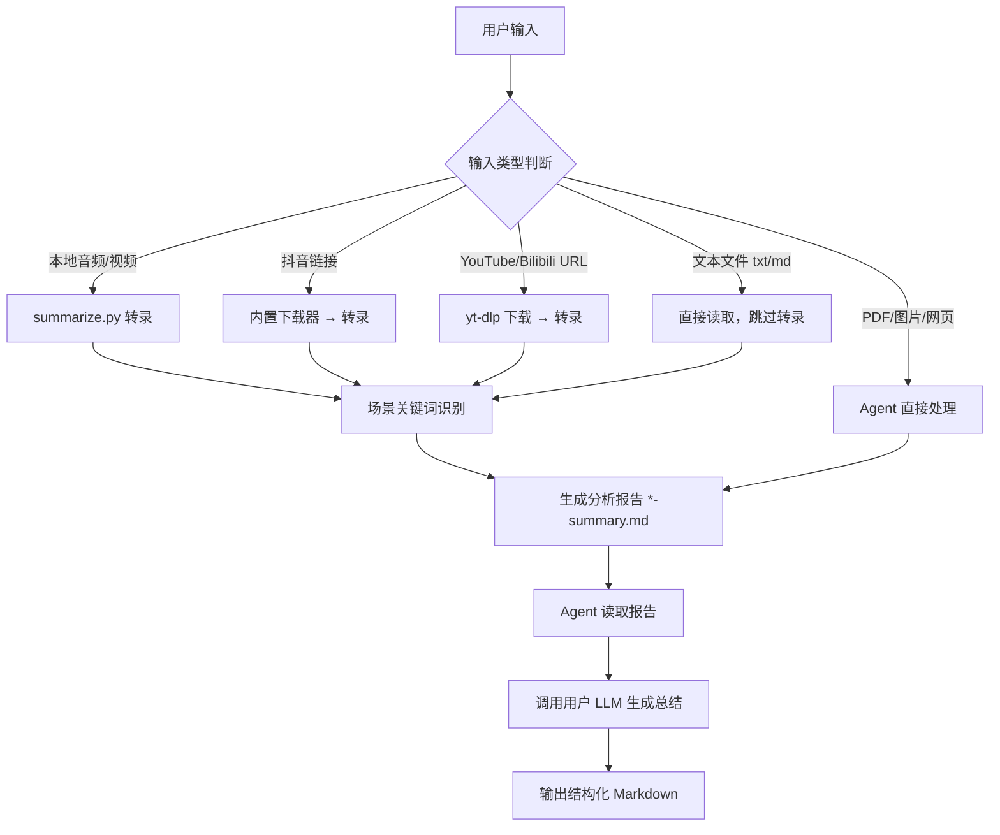

## 功能概览

此 Skill 负责将**各类输入内容**转换为可供 Agent 总结的结构化分析报告，分两个阶段：

1. **Skill 负责**：内容获取（下载/读取）→ 转录 → 场景识别 → 输出分析报告
2. **Agent 负责**：读取分析报告 → 调用用户配置的 LLM → 生成最终总结

---

## 支持的输入类型

| 输入类型 | 示例 | 处理方式 |
| -------- | ---- | -------- |
| **本地音频** | `meeting.mp3`, `record.m4a` | 直接上传 OpenClaw API 转录 |
| **本地视频** | `video.mp4`, `lesson.mov` | 提取音频后转录（需 ffmpeg） |
| **抖音链接/分享文本** | `https://v.douyin.com/xxx` | 内置抖音下载器下载后转录 |
| **在线视频 URL** | YouTube、Bilibili 等 | yt-dlp 提取音频后转录 |
| **PDF 文件** | `report.pdf` | 由 Agent 直接读取文本，无需脚本 |
| **图片** | `screenshot.png` | 由 Agent 视觉理解，无需脚本 |
| **网页 URL** | `https://example.com/article` | 由 Agent 抓取正文，无需脚本 |
| **文本文档** | `notes.txt`, `doc.md` | 直接读取文件内容，跳过转录 |

> PDF、图片、网页由 Agent 直接处理，不需要调用 `summarize.py`。

---

## 核心脚本

### `scripts/summarize.py` — 主入口

**常用调用方式**（Agent 调用）：

```bash
python3 skills/summarize-pro/scripts/summarize.py <输入文件或URL> --full --quiet
```

**参数说明**：

| 参数 | 说明 |
| ---- | ---- |
| `--full` / `-f` | 完整模式：转录 + 场景识别 + 生成分析报告（推荐） |
| `--quiet` / `-q` | 安静模式：只输出关键进度，适合 Agent 调用 |
| `--transcribe-only` / `-t` | 仅转录，不做场景分析 |
| `--summarize-only` | 仅场景分析（输入必须是已有的文本文件） |
| `--type <类型>` | 强制指定场景类型（meeting/interview/lecture/podcast/general） |
| `--language` / `-l` | 语言代码，默认 `zh` |
| `--output` / `-o` | 指定输出目录，不指定则自动生成带时间戳目录 |

**输出文件**（默认路径）：

```text
./summarizer-files/<时间戳>/<文件名>-transcript.txt
./summarizer-files/<时间戳>/<文件名>-summary.md
```

最后一行 stdout 输出 `summary.md` 的**绝对路径**，供 Agent 读取。

### `scripts/transcribe.py` — 转录子脚本

由 `summarize.py` 内部调用，不需要 Agent 直接调用。

```bash
python3 scripts/transcribe.py <音频文件> [--language zh]
```

转录结果输出到 stdout，`summarize.py` 捕获后写入 `*-transcript.txt`。

---

## 依赖关系

| 阶段 | 依赖 | 说明 |
| ---- | ---- | ---- |
| **转录** | 平台转录 API | 内置，无需用户 API Key |
| **场景识别** | 无 | 纯关键词匹配，无需 API |
| **总结** | 用户配置的 LLM | Agent 调用，不在此脚本内 |
| **视频格式转换** | ffmpeg（可选） | 处理 mov/avi/mkv 及超 25MB 文件 |
| **在线视频下载** | yt-dlp（可选） | YouTube/Bilibili 等，抖音不需要 |

---

## 场景识别规则

识别逻辑：对前 3000 字符做关键词计数，命中 ≥3 个则判定为该场景。

| 场景 | 代码 | 关键词（中文） | 阈值 |
| ---- | ---- | -------------- | ---- |
| **会议** | `meeting` | 讨论、决定、任务、负责人、下一步、安排、会议、团队、完成、项目 | ≥3 |
| **访谈** | `interview` | 访谈、用户、痛点、需求、问题、回答、请问、体验、使用、反馈 | ≥3 |
| **课程** | `lecture` | 课程、学习、知识、概念、理解、重点、大纲、同学、今天讲、掌握 | ≥3 |
| **播客** | `podcast` | 播客、节目、嘉宾、话题、观点、分享、故事、经历、觉得、聊聊 | ≥3 |
| **通用** | `general` | 无关键词命中时的兜底 | — |

> ⚠️ 关键词为**中文**，对英文内容场景识别可能不准，建议用 `--type` 强制指定。

---

## 抖音链接处理

`summarize.py` 内置抖音下载器，**禁止对抖音链接使用 yt-dlp**。

处理流程：

1. 从分享文本提取 `modal_id`（支持短链/长链/纯数字 ID）
2. 访问 `iesdouyin.com` 获取视频直链
3. 下载视频到 `~/.openclaw/workspace-av_summarizer-1/files/`
4. 若视频 >25MB 且有 ffmpeg，自动提取音频
5. 调用 平台转录 API 转录

---

## 工作流程



---

## 分析报告格式

`*-summary.md` 的内容结构：

```text
# 📊 Transcription Analysis Report

文件名、处理时间、内容类型、字数、估算时长

## 🎯 场景识别结果
场景类型 + 总结策略指导

## 📝 Full Transcript
完整转录原文

## 🤖 Next Step
Agent 操作提示
```

Agent 读取此报告后，按照"总结策略指导"调用 LLM 生成最终用户总结。

---

## 错误处理

| 错误情况 | 行为 |
| -------- | ---- |
| OpenClaw 未登录 | `sys.exit(1)`，打印登录提示 |
| 抖音下载失败 | `sys.exit(1)`，不回退到 yt-dlp ，打印抖音失败|
| yt-dlp 未安装 | 打印安装提示，`return False` |
| 转录 API 失败 | `sys.exit(1)`，打印 API 错误 |
| 文件不存在 | `sys.exit(1)`，打印路径 |
| ffmpeg 不可用 | 降级处理（直接上传原文件），不中断 |
